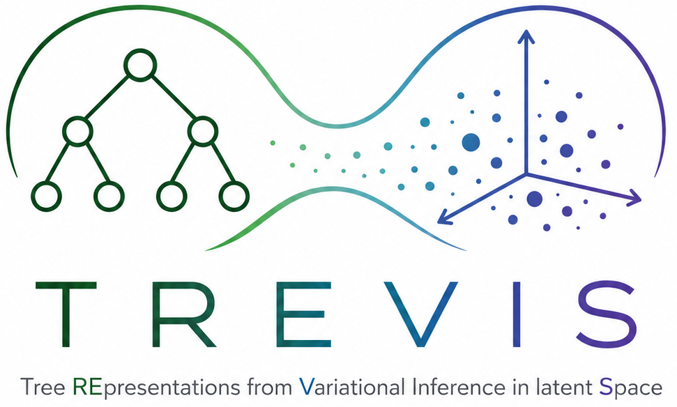

<p align="center">
  
</p>

TREVIS (Tree REpresentations from Variational Inference in latent Space) is a generative approach to Decision Tree (DT) learning based on the exploration of the latent space of a Tree Transformer Variational Auto-Encoder (TTVAE), allowing for optimization w.r.t. complex objectives.

# Usage

To run TREVIS, follow these steps:

1. **Download this repository on your local machine**.
2. **Fit random train DTS**. Edit the `config/random_trees_config.json` file with your preferred configuration and run:

   ```bash
    python3 scripts/random_trees_.py 
    ```
4. **Tokenize random DTs**. Edit the `config/tokenize_config.json` file with your preferred configuration and run:

   ```bash
    python3 scripts/tokenize.py 
    ```
5. **Train the TTVAE**. Edit the `config/train_ttvae_config.json` file with your preferred configuration and run:

    ```bash
    python3 scripts/train_ttvae.py 
    ```

7. **Optimize via gradient ascent**. Edit the `config/gradient_config.json` file with your preferred configuration and run:

   ```bash
    python3 scripts/gradient.py 
    ```

Alternatively, set all configuration files in `config` and run:

  
  ```bash
  bash scripts/trevis.sh
  ```

to automatically run steps 1-7. Best found DTs are stored in `experiments/best_dts.json`

# Data

# Experiments

## Competitors

We compare against the following competitors. Please refer to the corresponding repositories for implementation details and requirements:

- `gosdt_lb`: [GOSDT with guesses](https://github.com/ubc-systopia/gosdt-guesses)
- `DL8.5`: [PyDL8.5](https://github.com/aia-uclouvain/pydl8.5)
- `DL8.5-lbguess`: [PyDL8.5 with guessed tighter lower bounds](https://github.com/ubc-systopia/pydl8.5-lbguess)
- `FlowOCT`: [ODTLearn FlowOCT implementation](https://github.com/D3M-Research-Group/odtlearn/blob/main/odtlearn/flow_oct.py)
- `CART`: [Scikit-learn DecisionTreeClassifier](https://scikit-learn.org/stable/modules/generated/sklearn.tree.DecisionTreeClassifier.html)

# License
TREVIS is distributed under the GNU General Public License. Refer to LICENSE.txt for details.
